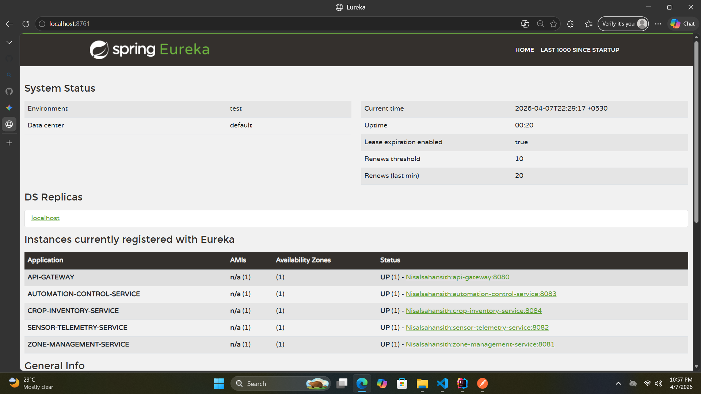
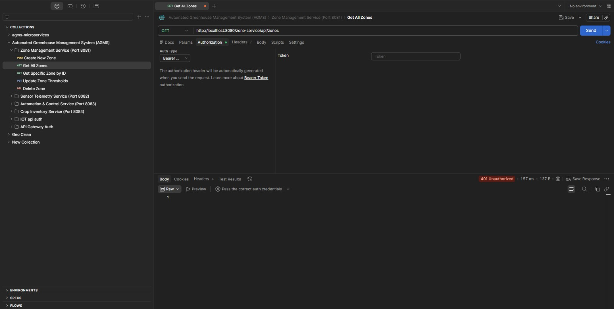
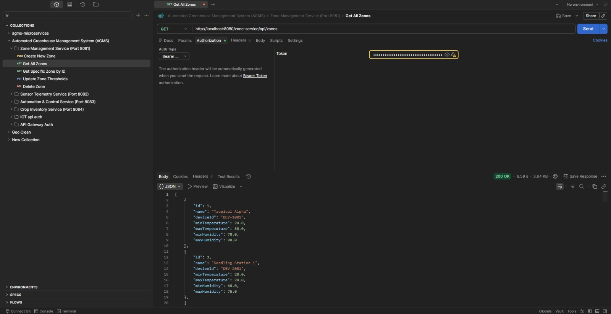

# Automated Greenhouse Management System (AGMS)

This project is built using a Microservices Architecture. To ensure proper service discovery and routing, the infrastructure components must be started before the domain-specific services.

## 🚀 Infrastructure Startup Sequence

Follow these steps in order to start the system:

### 1. Service Discovery (Eureka Server)
* **Navigate to:** `discovery-server` directory.
* **Run:** `./mvnw spring-boot:run`
* **Verify:** Open [http://localhost:8761](http://localhost:8761) in your browser. Ensure the dashboard loads.

### 2. Configuration Server (Config Server)
* **Navigate to:** `config-server` directory.
* **Run:** `./mvnw spring-boot:run`
* **Note:** Wait for this to fully start as other services depend on it for their properties.

### 3. API Gateway
* **Navigate to:** `api-gateway` directory.
* **Run:** `./mvnw spring-boot:run` (Port: 8080)
* **Note:** The gateway acts as the single entry point for all API calls.

---

## 🛠 Domain Services
Once the infrastructure is **UP**, you can start the following services in any order:
* **Zone Management Service** (Port: 8081)
* **Sensor Telemetry Service** (Port: 8082)
* **Automation & Control Service** (Port: 8083)
* **Crop Inventory Service** (Port: 8084)

## 🧪 Testing the API
A Postman collection is provided in the root directory: `AGMS.postman_collection.json`.
1. Open Postman.
2. Click **Import**.
3. Select the `.json` file from the project root.
4. Use the `API Gateway Auth` folder to log in (Username: `nisal`, Password: `1234`).

## 📊 System Status

### Eureka Discovery Dashboard
This screenshot shows all microservices successfully registered and running.

### API Gateway Routing
Verification of the API Gateway handling requests.

## 📊 System Status
You can find the screenshot of the registered services in the `docs/` folder.
Current status: All services registered via Eureka with status **UP**.